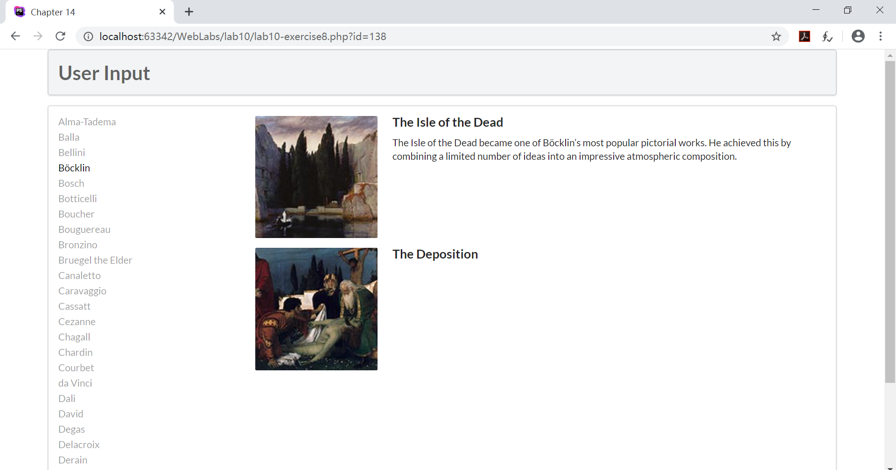

# Web Lab10实现文档

段欣然 18307130295


## Execise 7

#### 实现截图


#### 方法1

```php
<?php
try {
    //利用PDO链接数据库
    $pdo = new PDO(DBCONNSTRING,DBUSER,DBPASS);
    //设置数据库句柄属性，设置错误处理方式：抛出exceptions异常
    $pdo->setAttribute(PDO::ATTR_ERRMODE, PDO::ERRMODE_EXCEPTION);
    //通过数据库语句查询Artists，以LastName为基准排序
    $sql = "select * from Artists order by LastName";
    //存储查询结果
    $result = $pdo->query($sql);
    //若返回值不为空，则以下述格式以行为单位打印结果
    while ($row = $result->fetch()) {
        echo $row['ArtistID'] . " - " . $row['LastName'] . "<br/>";
    }
    //释放资源
    $pdo = null;
}catch (PDOException $e) {
    //处理错误信息
    die( $e->getMessage() );
}
?>
```

代码解释见注释，这里实现的是在页面上打印动态排序后的数据库查询结果。


#### 方法2

```php
    <?php
    //链接数据库
    $connection = mysqli_connect(DBHOST, DBUSER, DBPASS, DBNAME);
    //处理链接错误
    if ( mysqli_connect_errno() ) {
        die( mysqli_connect_error() );
    }
    //通过数据库语句查询Artists，以GenreName为基准排序
    $sql = "select * from Genres order by GenreName";
    //若返回值不为空，则将信息逐条加入select选项中
    if ($result = mysqli_query($connection, $sql)) {
        // loop through the data
        while($row = mysqli_fetch_assoc($result)) {
            echo '<option value="' . $row['GenreID'] . '">';
            echo $row['GenreName'];
            echo "</option>";
        }
        // release the memory used by the result set
        mysqli_free_result($result);
    }
    // close the database connection
    mysqli_close($connection);
    ?>
```

代码解释见注释，这里实现的是将动态排序后的数据库查询结果加到select的选项中。


## Execise 8

#### 实现截图





#### function outputArtists()

```php
function outputArtists() {
   try {
         //利用PDO链接数据库
         $pdo = new PDO(DBCONNSTRING,DBUSER,DBPASS);
         //设置数据库句柄属性，设置错误处理方式：抛出exceptions异常
         $pdo->setAttribute(PDO::ATTR_ERRMODE, PDO::ERRMODE_EXCEPTION);
         //通过数据库语句查询Artists，以LastName排序，返回前三十个
         $sql = "select * from Artists order by LastName limit 0,30";
         //存储查询结果
         $result = $pdo->query($sql);
         //若返回值不为空，则将它们包装在一个a标签中并显示条目的LastName
         //超链接url=当前相对路径+PHP程序文件名称+对应的数据的id。
         while ($row = $result->fetch()) {
            echo '<a href="' . $_SERVER["SCRIPT_NAME"] . '?id=' . $row['ArtistID'] . '" class="';
            //当鼠标浮动到a标签上时，设置active标签实现点击高亮 
            if (isset($_GET['id']) && $_GET['id'] == $row['ArtistID']) echo 'active ';
            echo 'item">';
            echo $row['LastName'] . '</a>';
         }
         //释放资源
         $pdo = null;
   }
   catch (PDOException $e) {
      //处理错误信息
      die( $e->getMessage() );
   }
}
```

代码解释见注释。


#### function outputPaintings()

```php
function outputPaintings() {
    try {
        //当点击a标签时，获取id
        if (isset($_GET['id']) && $_GET['id'] > 0) {
            //利用PDO链接数据库
            $pdo = new PDO(DBCONNSTRING,DBUSER,DBPASS);
            //设置数据库句柄属性，设置错误处理方式：抛出exceptions异常
            $pdo->setAttribute(PDO::ATTR_ERRMODE, PDO::ERRMODE_EXCEPTION);
            //通过数据库语句查询Artists的id对应的Paintings
            $sql = 'select * from Paintings where ArtistId=' . $_GET['id'];
            //存储查询结果
            $result = $pdo->query($sql);
            //若返回值不为空，则调用outputSinglePainting()函数，显示每张图片
            while ($row = $result->fetch()) {
                outputSinglePainting($row);
            }
            //释放资源
            $pdo = null;
        }
    }catch (PDOException $e) {
        //处理错误信息 
        die( $e->getMessage() );
    }
}
```

代码解释见注释。


#### function outputSinglePainting($row)

```php
function outputSinglePainting($row) {
    echo '<div class="item">';
    echo '<div class="image">';
    //利用$row的ImageFileName字段构造图片的src
    echo '';
    echo '</div>';
    echo '<div class="content">';
    echo '<h4 class="header">';
    //将$row的Title字段信息放在h4标签中
    echo $row['Title'];
    echo '</h4>';
    echo '<p class="description">';
    //将$row的Excerpt字段信息放在p标签中
    echo $row['Excerpt'];
    echo '</p>';
    echo '</div>'; // end class=content
    echo '</div>'; // end class=item
}
```

输出html语句，关键代码解释见注释。


## Execise 9

#### 实现截图


#### PDO中执行SQL语句的方法


##### 第一种方法：exec()方法

exec()方法返回执行SQL 语句后受影响的行数，其语法格式如下：

```php
int PDO::exec(string statement)
```

参数 satatement 是要执行的SQL语句，该方法返回执行SQL 语句时受影响的行数，通常用于 INSERT，DELETE和UPDATE语句中。

##### 第二种方法：query()方法

query()方法用于返回执行查询后的结果集，该函数的语法格式如下如下：

```php
PDOStatement PDO::query(string statement)
```

参数 satatement 是要执行的 SQL语句，它返回的是一个PODStatement对象。

query和exec都可以执行所有的sql语句，只是返回值不同而已；query可以实现所有exec的功能。

##### 第三种方法：预处理语句：prepare()语句和execute()语句

预处理语句包括prepare()和execute()两种方法。首先，通过prepare()方法做查询准备工作，然后通过execute()方法执行查询，并且还可以通过bindParam()方法来绑定参数给execute()方法，语法如下：

```php
PDOStatement PDO::prepare(string statement[,array driver_options])
bool PDOStatement::execute([array input_parameters])
```

使用预处理语句的好处有：预处理语句会将传入的SQL命令封装在PreparedStatement对象中，事先进行预编译处理等待使用。当有单一的SQL语句多次执行时，用PreparedStatement类会比Statement类更有效率。而且，提供给预处理语句的参数不需要用引号括起来，驱动程序会自动处理，减少了发生SQL注入的风险。


## Execise 10

#### 实现截图


#### function outputGenres()

```php
function outputGenres() { 
   try {
      $pdo = new PDO(DBCONNSTRING,DBUSER,DBPASS); 
      $pdo->setAttribute(PDO::ATTR_ERRMODE, PDO::ERRMODE_EXCEPTION);

      $sql = 'select GenreId, GenreName, Description from Genres Order By GenreID';
      $result = $pdo->query($sql); 
      
      while ($row = $result->fetch()) {
         outputSingleGenre($row); 
      }
      $pdo = null;
   }catch (PDOException $e) {
      die( $e->getMessage() ); 
   }
} 
```

该函数实现的功能是通过GenreId从Genres中取出图片的id、name和description。


#### function outputSingleGenre($row)

```php
function outputSingleGenre($row) {
   echo '<div class="ui fluid card">';
   echo '<div class="ui fluid image">';
   $img = ''; 
   echo constructGenreLink($row['GenreId'], $img);
   echo '</div>';
   echo '<div class="extra">';
   echo '<h4>';
   echo constructGenreLink($row['GenreId'], $row['GenreName']);
   echo '</h4>';
   echo '</div>'; // end class=extra
   echo '</div>'; // end class=card
   }
```

该函数实现的功能是展示每一个Gerne的div，同时调用constructGenreLink($id, $label)来构建图片和标题的超链接。

#### function constructGenreLink()

```php
function constructGenreLink($id, $label) {
   $link = '<a href="genre.php?id=' . $id . '">'; 
   $link .= $label;
   $link .= '</a>';
   return $link;
}
```

该函数实现的功能是构建超链接，指向id对应的展示详细信息页面。