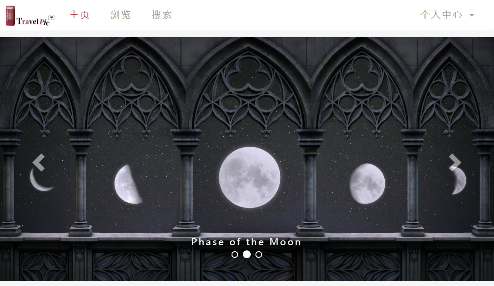
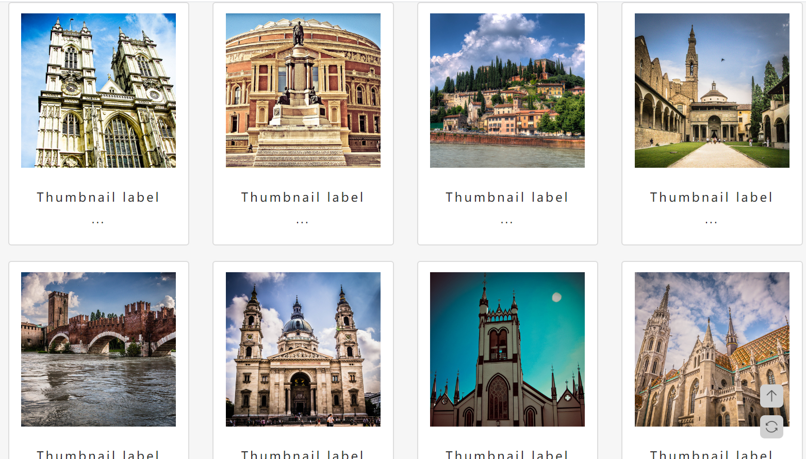
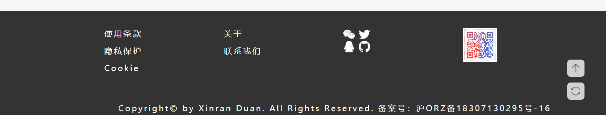
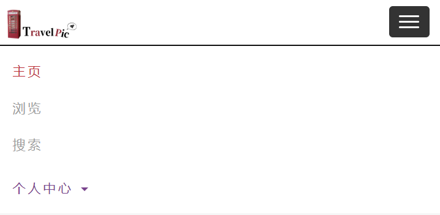

## Web Lab4 设计文档

段欣然 18307130295

#### 网页概览

顶部导航栏及头图（由于拉伸网页原因未截入辅助功能按钮）

中部图片展示区及辅助功能按钮

底部footer

#### 设计思路

主页的配色采用简洁的黑白设计，以下主要介绍由Bootstrap生成的页面布局。

##### nav

导航栏使用Bootstrap自带的导航栏类navbar，将导航栏分为左右两个部分，左侧是页面导航，右侧是个人中心，个人中心中有四个不同的基于个人的功能。实现基于助教的源代码进行修改，添加了自己的Logo，将配色修改为白色底色，为了避免死板而对导航栏的不同部分设置了不同颜色的停留高亮，并对修改色彩而导致的响应式布局中按钮色彩冲突进行了改色（通过CSS实现）。

（例如，此时页面宽度缩小，鼠标悬停在个人中心上，产生高亮效果）

##### carousel

滚动图片布局使用Bootstrap自带的carousel实现，放置三张比例相同、适合作为头图的图片。

其中“carousel-indicators”为轮播指标，"carousel-inner"为轮播项目（即图片），"carousel-control"为控制左右移动的按钮，只要稍作修改即可。

##### corner buttons

这一部分由原生css实现，将在pj1文档中进行具体说明。

##### picture display area

此处使用Bootstrap自带的布局进行实现，我使用的是"col-sm-6 col-md-3"，这样在我1920x1080的屏幕下，全屏显示的是四个div，排版布局比较美观。此外，这个布局也是响应式的，改变页面的大小，div的大小也会相应改变。

由于我使用css裁剪非正方形图片，使它们以比较美观且不变形的方式展示出来，故此处不修改为bootstrap，具体实现方式将在pj1文档中进行具体说明。

##### footer

页面底部的footer以助教模板为基础，增加制作人信息、通讯图标与二维码。

#### 实验心得

通过这次实验，我了解到了Bootstrap功能的强大之处，它用来做响应式布局真的很方便，提供的模板都很简洁大方又美观，除了一些特定的功能（比如背景图片裁剪）和颜色设置，其他基本布局都可以用它来实现。当然，作为初学者还是要打好html基础，在熟练掌握html、css之后再去使用它。

