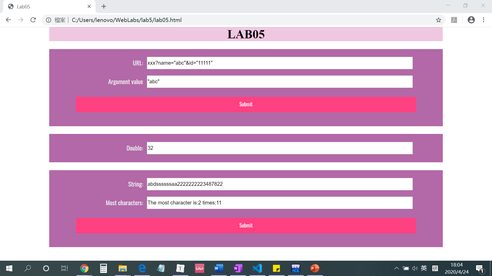

# Web Lab5设计文档

段欣然 18307130295


## 网页截图

#### Github截图


#### 网页效果截图



## 设计思路

本次lab主要设计JavaScript函数的使用，来实现三个不同的小任务。


#### Problem1

##### 题目要求

1. 获取url中名为name的参数。在URL输入框输入url，点击同行submit按钮后，其中的参数名为name的参数值需要出现在Argument value输入框内。
2. 如果没有名为name的参数，那么可以在Argument value输入框出现任何值。
3. 请仅在showWindowHref函数内写代码。

##### 涉及知识点

1. 按特定方法分割字符串并取出特定值
2. 对象的赋值与属性访问

##### 实现方法

1. 取出url.value，得到url字符串。

2. 根据url的格式：（若干字符串）?（参数名1）=（参数1值）&（参数2）=（参数2值），利用split将?前面的字符串部分与后面的参数部分分开；再利用split将&前面的参数名与参数值分开。

   ```javascript
       arr = url_val.split("?");
       arr_split = arr[1].split("&");
   ```

3. 创建一个obj数组，将=前后字符分开，注意可以直接把参数名作为属性名，利用方括号访问法访问；如果name属性不存在，会返回undefined并显示在网页上。

   ```javascript
       let obj={};
       for(let i = 0; i < arr_split.length; i++){
           arg = arr_split[i].split("=");
           obj[arg[0]] = arg[1];
       }
       url_result.value = obj["name"];
   ```


#### Problem2

##### 题目要求

1. 每隔五秒运行一次函数直到某一整分钟停止，比如从20:55:45运行到20:56:00停止；或者运行10次，先到的为准。从1开始每过五秒，输入框内数值翻倍。初始值为1。

##### 涉及知识点

1. 设置时间相关函数的选择与使用
2. 函数调用、匿名函数、函数变量
3. 新建对象与方法调用

##### 实现方法

1. 新建计数变量i；获得当日的日期和时间可以通过新建Date类对象来实现。

   ```javascript
       let i = 0;
       let start = new Date();
       mul.value = 1;
   ```

2. 通过查询资料，发现控制时间的函数有setInterval和setTimeout，setInterval()自从载入后，以指定时间为周期循环执行表达式，而setTimeout()只在指定时间后执行一次表达式。根据题意，我们需要多次double效果，故timeTest()中选择前者。注意它需要手动清除，因此我们通过计数变量和对执行时minute与开始时minute的比较，来判断是否清除。

   这里的setInterval()函数中第一个值是一个表达式，我们用匿名函数来实现倍增过程，将该匿名函数作为表达式来实现。

   ```javascript
   function timeTest(){
       let i = 0;
       let start = new Date();
       mul.value = 1;
       setInt = setInterval(function(){
           let now = new Date();
           if(now.getMinutes()!==start.getMinutes() || ++i>10) {
               return clearInterval(setInt);
           }
           mul.value *= 2;
       }, 5000);
   }
   ```

3. 由于题目要求，我们利用window.onload使函数在对于初值1的显示，我们可以使用setTimeout()进行延时载入，将timeTest()作为一个函数表达式被setTimeout赋值调用。

   ```javascript
   let doTimeTest = setTimeout("timeTest()",5000);
   window.onload = doTimeTest;
   ```


#### Problem3

##### 题目要求

1. 判断输入框most里出现最多的字符，并统计出来。统计出是信息在most_result输入框内以"The most character is:" + index + " times:" + max的形式显示。

##### 涉及知识点

1. EventListener的选择
2. 对象的遍历与枚举
3. 对象的比较

##### 实现方法

2. 对于most中的输入，我们使用一个变量来接受它，并把它逐字符拆开存放在obj数组中，obj[arr.charAt(i)]存放的是它的出现次数。

   ```javascript
       let obj = {};
       arr = most.value; 
       for(let i = 0; i < arr.length; i++){
           if(!obj[arr.charAt(i)]){
               obj[arr.charAt(i)] = 1;  
           } else{
                obj[arr.charAt(i)]++;
           }
       }
   ```
3. 对于obj中的对象，我们利用for in枚举对象的属性名，查找最大值，查找完毕后更改result.value即可。

   ```javascript
       let max = 0;
       let index = '';
       for(let i in obj){
           if(obj[i] > max){
               max = obj[i];
               index = i;
           }
       }
       if(max === 0) result.value = "";
           else result.value = "The most character is:" + index + " times:" + max;
   ```

