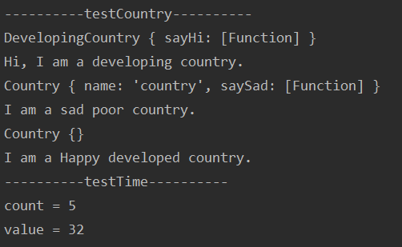

# Web Lab6设计文档

段欣然 18307130295


## 实现截图

#### github截图


#### 本地运行截图




## 设计思路

本次lab主要设计JavaScript函数的使用，来实现八个不同的小任务。


### 各个正则表达式的理解

本次Lab统一使用正则表达式的格式为 /pattern/attributes，即使用直接量。

#### testMail

```javascript
reTel = /^(13[0-9]|14[5|7|9]|15[0|1|2|3|5|6|7|8|9]|16[6]|17[1|2|3|5|6|7|8]|18[0|1|2|3|5|6|7|8|9]|19[1|8|9])\d{8}$/g;
    var reMail = /^\w[-\w.+]*@([A-Za-z0-9][-A-Za-z0-9]+\.)+[A-Za-z]{2,14}$/g;
```

reTel是检测手机号码的正则表达式，开始处的^和结尾处的$分别表示表达式的起始位置和结束位置，()中是组，这里通过将前三位分为一组来规定手机号码的正确性，用|分隔表示or，即满足其中一种即可。例如13[0-9]是指前三位为13x，x可以为0-9任何数字。之后的\d{8}指匹配8个数字。/g表示全局匹配。

reMail是检测邮箱的正则表达式，开始处的^和结尾处的$分别表示表达式的起始位置和结束位置，\w 元字符用于查找单词字符（a-z、A-Z、0-9，下划线）；[-\w.+]表示查找方括号之间的任何字符，此处有与-、+、.中任意字符的组合，每个字符可以出现零次至多次。然后需要匹配一个@符号，和零个或多个大小写字母或数字开头，大小写字母、数字和-字符组成，最后以.结尾的组合。最后以一个只有大小写字母组合，长度为2-14的组合结尾。/g表示全局匹配。

附：三大运营商号段

```
中国电信号段133、149、153、173、177、180、181、189、191、199
中国联通号段130、131、132、145、155、156、166、171、175、176、185、186
中国移动号段134、135、136、137、138、139、147、150、151、152、157、158、159、172、178、182、183、184、187、188、198 
```


#### testRedundancy

```javascript
var reString = /\b([a-z]+) \1\b/gi
```

\b用来匹配单词边界，([a-z]+)表示仅有小写字母a-z（由于需要忽略大小写，因此只匹配小写字母），中间有一个空格（没有做多个空格的处理，若需要处理的话修改str变量即可，和testSpecialReverse方法相似），\1表示的是正则表达式里，第一个小括号捕获到的内容。/gi表示全局匹配且忽略大小写。


### 继承不同方式的理解

#### 构造函数

```javascript
//构造函数
function DevelopingCountry() {
    Country.call(this);
    this.name = "developing country";
    if(typeof this.sayHi != "function")
        DevelopingCountry.prototype.sayHi = function(){ return "Hi, I am a " + this.name + ".";};
}
```

使用构造函数的基本思想是在子类构造函数内部使用call调用父类构造函数，本质是在子类实例中创建了父类属性。使用它的优势是比较方便快捷，语法比较易懂。因为方法都在构造函数中定义，因此父类实例方法无法复用，会产生一定的浪费问题；而且，父类原型中的属性和方法对子类不可见，因此无法同时使用构造和原型。此外，应在子类构造函数一开始调用父类构造函数，必须使用call的调用方式，否则容易造成无限循环。

在这里为了使sayHi函数存在子类实例中，我们使用if语句来定义。它的原型即自身。


#### 原型链

```javascript
//原型链
function PoorCountry() {
    this.name = "poor country";
    if(typeof this.saySad != "function")
        PoorCountry.prototype.saySad = function(){ return "I am a sad " + this.name + ".";};
}

PoorCountry.prototype = new Country();
```

原型链继承的本质是将子类的原型设为父类的实例，可以在子类原型中覆盖父类方法（此处未提及）。它的原型为父类。原型链可以一定程度上避免构造函数中的浪费问题与父类属性、方法的不可见问题，但是它也存在一些问题：父类中的实例属性会成为子类的原型属性（尤其是父类实例属性属于引用类型的时候），并且无法在不影响所有子类实例情况下向父类构造函数传参。


#### Object.create

```javascript
//Object.create 继承对象版本
let DevelopedCountry = Object.create(Country, {
    name : {
        value : "developed country"
    },
    sayHappy : {
        value : function () {
            return "I am a Happy " + this.name + ".";
        }
    }
});
```

Object.create方法能够创建一个新对象，使用现有的对象来提供新创建的对象的proto。它是一种原型式继承，实质是基于已有对象创建新对象，本质上是做了已有对象的浅复制（即不会重新创建引用类型的新实例）。它的原型是所继承的对象，即create()中的第一个字段。当我们需要继承已有对象而不是基于原型继承时，选用它更加合适。但它也存在一些问题：由于是浅复制，初始对象中的引用类型属性会被所有副本共享，可能会存在越权访问等问题。


在我们的工程之中，首先需要区分继承的父类与子类需要实现的功能，再选择合适的继承方法。当然，也可以使用组合继承来避免一些问题。


### Map、Set、Array之间的区别和使用

#### Map

Map是使用键的集合对象，对象在存储数据时会使用到键，支持按照插入顺序来迭代元素。它的本质是一个键值对有序列表，一个 Map的键可以是任意值，包括函数、对象或任意基本类型。

它一般用于缓存频繁读取的数据，可以用于hash，每一次set的如果是重复的key，那原先的value将会被覆盖。对于简单类型，对键的比较是对值的严格比较；对于复合类型，对键的比较本质是对内存地址的比较。因此，如果我们需要频繁知道不同的值是否曾经出现过、出现在何处，或是需要频繁增删键值对，使用Map会是比较好的选择。

##### Map对象方法

| 方法           | 描述                                                         |
| :------------- | :----------------------------------------------------------- |
| clear()        | 移除Map对象的所有键/值对                                     |
| delete(key)    | 如果Map对象中存在该元素，则移除它并返回true；否则返回false。 |
| entries()      | 返回一个新的Iterator对象，它按插入顺序包含了Map对象中每个元素的 [key, value] 数组。 |
| forEach(func)  | 按插入顺序，为Map对象里的每一键值对调用一次func函数。        |
| get(key)       | 返回键对应的值，如果不存在，则返回undefined。                |
| has(key)       | 返回一个布尔值，表示Map实例是否包含键对应的值。              |
| keys()         | 返回一个新的Iterator对象， 它按插入顺序包含了Map对象中每个元素的键。 |
| set(key,value) | 设置Map对象中键的值                                          |
| values()       | 返回一个新的Iterator对象，它按插入顺序包含了Map对象中每个元素的值 。 |

##### 应用举例

下例实现了即使寻找并存取字符串出现最右端index。

```javascript
//lengthOfLongestSubstring(str)
	let map = new Map();
	let left = 0; //最长子串左Index
    for (let right = 0; right < str.length; right++) { //最长子串右Index
        let ch = str.charAt(right);
        if (map.get(ch) !== undefined) {
            left = Math.max(map.get(ch) + 1, left);
        }
        maxlen = Math.max(maxlen, right - left + 1);
        map.set(ch, right);
    }
```


#### Set

Set也是使用键的集合对象。Set对象是值的集合，可以按照插入的顺序迭代它的元素。 Set中的元素只会出现一次，是唯一的。因此，判断成员唯一性时不做类型转换，相当于做===比较。当我们需要检测某值是否存在时，使用Set更为合适。

##### Set对象方法

| 方法          | 描述                                                         |
| :------------ | :----------------------------------------------------------- |
| add(value)    | 在Set对象尾部添加一个元素                                    |
| clear()       | 移除Set对象内的所有元素                                      |
| delete(value) | 如果Set对象中存在该元素，则移除它并返回true；否则返回false。 |
| entries()     | 返回一个新的迭代器对象，该对象包含Set对象中的按插入顺序排列的所有元素的值的[value, value]数组。为了使这个方法和Map对象保持相似， 每个值的键和值相等。 |
| forEach(func) | 按插入顺序，为Set对象里的每一个值调用一次func函数。          |
| has(value)    | 返回一个布尔值，表示该值在Set中存在与否。                    |
| keys()        | 返回一个新的迭代器对象，该对象包含Set对象中的按插入顺序排列的所有元素的值。 |
| values()      | 返回一个新的迭代器对象，该对象包含Set对象中的按插入顺序排列的所有元素的值。 |

##### 应用举例

下例使用Set避免了重复问题。

```javascript
//testKeyBoard(wantInput, actualInput)
let res = new Set();
while (i < wantInput.length) {
    var ch = wantInput.charAt(i).toString();
    var chUpper = ch.toUpperCase();
    if(j >= actualInput.length){
        res.add(chUpper);
    } else {
        if(ch === actualInput.charAt(j)) j++;
        else res.add(chUpper);
    }
    i++;
}
```


#### Array

Array是数组，所有数组都是Array类型实例。它是按照索引值来排序的数据集合。

Array类型提供了丰富的数组操作方法，可以使用不同的方法从数组尾部、中部、头部对数组进行修改，但我们一般习惯使用for循环修改，或者使用push/pop对尾部进行处理。数组有下标，因此可以进行排序（sort）和倒置（reverse），此外，通过join和split方法可以在字符串和数组之间轻松地进行转换。因此，如果需要和字符串互相转换，或是需要通过下标处理数据而不在意重复，使用数组最为合适。


##### Array 对象方法

| 方法       | 描述                                                         |
| :--------- | :----------------------------------------------------------- |
| concat()   | 连接两个或更多的数组                                         |
| join()     | 把数组的所有元素放入一个字符串，元素通过传入的指定的分隔符进行分隔。 |
| pop()      | 删除并返回数组的最后一个元素                                 |
| push()     | 向数组的末尾添加元素                                         |
| reverse()  | 颠倒数组中元素的顺序                                         |
| shift()    | 删除并返回数组的第一个元素                                   |
| slice()    | 从某个已有的数组返回选定的元素                               |
| sort()     | 对数组的元素进行指定方法排序                                 |
| splice()   | 删除元素，并向数组添加新元素。                               |
| toString() | 把数组转换为字符串                                           |
| unshift()  | 向数组的开头添加一个或更多元素                               |

##### 应用举例

下例就轻松实现了对res数组地倒置和连结为字符串。

```javascript
//testSpecialReverse(str)
let res = new Array();
...
console.log(res.reverse().join(" "));
```


