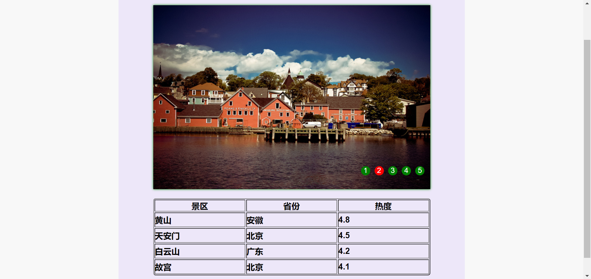

# Web Lab8设计文档

段欣然 18307130295


## 实现截图



样式均在lab8.css中修改，不为重点，此处不予介绍。


## 设计思路


#### 全局变量

通过通读文档，定义需要使用的全局变量如下：

```javascript
//左翻页箭头
const leftArrow = document.getElementsByClassName("arrow_left")[0];
//右翻页箭头
const rightArrow = document.getElementsByClassName("arrow_right")[0];
//右下页码按钮
const btns = document.getElementsByTagName("span");
//图片展示框
const wrapper = document.getElementsByClassName("wrap")[0];
//计时器
let timer = null;
```

其中除了计时器以外，为了规范起见都定义为const。


#### Problem1

首先，我们根据题目需求，点击向左的箭头，会切换到上一张图片；点击向右的箭头，会切换到下一张图片，右下角的按钮颜色也会随着图片的切换而变化。那么我们需要找出wrapper中图片排列的规律，以及将图片与右下页码按钮进行对应。具体思路如下代码即注释所示：

```javascript
function toPrevPic() {
    //获取当前高亮按钮
    let onBtn = document.getElementsByClassName("on")[0];
    //通过按钮的innerHTML，读取按钮编号
    let picId = onBtn.innerHTML;
    //wrapper是一个将多个图片横向排序放置在内，可以通过调整left值来调整显示图片的包裹块
    wrapper.style.left = -(picId - 1) * 600 + "px";
    if(picId == 1) picId = 6;
    //修改当前高亮按钮
    onBtn.classList.remove("on");
    btns.item(picId - 2).classList.add("on");
}
```

对于向右的箭头也使用类似的写法，但需要注意的是，js中的+默认为字符串相接，因此计算wrapper.style.left时为了避免麻烦，我们统一使用''-"/。

```javascript
    //parseInt(a)+parseInt(b)可解决1+1 = 11问题，但为了方便使用减号即可
    wrapper.style.left = (- picId - 1) * 600 + "px";
```

最后，为箭头添加EventListener。

```javascript
leftArrow.addEventListener("click", toPrevPic);
rightArrow.addEventListener("click", toNextPic);
```


#### Problem2

实现轮播只需要加一个定时器即可，而通过鼠标移入或移出轮播区域内时，停止或重新进入自动播放，也可以通过addEventListener来实现。

```javascript
function myCarousel() {
    timer = setInterval(function() {
        toNextPic()}, 2000);
}
//页面载入即执行
window.addEventListener("load", function() {
    myCarousel();
});

wrapper.addEventListener("mouseover", function() {
    clearInterval(timer);
});

wrapper.addEventListener("mouseout", function() {
    myCarousel();
});
```

由于我个人觉得左右箭头也在轮播区域内，但经过测试鼠标放置在其上时轮播继续，因此也为它们实现了一个清除轮播的操作。

```javascript
//左右箭头也在区域内
leftArrow.addEventListener("mouseover", function() {
    clearInterval(timer);
});

rightArrow.addEventListener("mouseover", function() {
    clearInterval(timer);
});

```


#### Problem3

为每个增加click事件即可。注意此处也需要增加清除轮播操作。

```javascript
function btnOnClick() {
    for(let i = 0 ; i < btns.length; i++ ) {
        let nowBtn = btns.item(i);
        nowBtn.addEventListener("click", function () {
            let onBtn = document.getElementsByClassName("on")[0];
            let picId = nowBtn.innerHTML;
            wrapper.style.left = (- picId) * 600 + "px";
            onBtn.classList.remove("on");
            nowBtn.classList.add("on");
        });
        nowBtn.addEventListener("mouseover", function() {
            clearInterval(timer);
        });
    }
}

btnOnClick();
```


#### Problem4

使用jQuery实现该任务，中心思想是点击td时将当前位置替换为Input框，在此处失去对焦时改为一般html，值为input框中的值。

```javascript
$('table td').click(function(){
    if(!$(this).is('.input')){
        //将原来的位置替换为input框
        $(this).addClass('input').html('<input type="text" value="'+ $(this).text() +'" />').find('input').focus().blur(function() {
            //失去对焦之后删除input框，html变为input框中的值
            $(this).parent().removeClass('input').html($(this).val() || 0);
        });
    }
    //光标自动定位于单元格的首个字符或者汉字前
    $(this).textFocus(0);  
});
```

